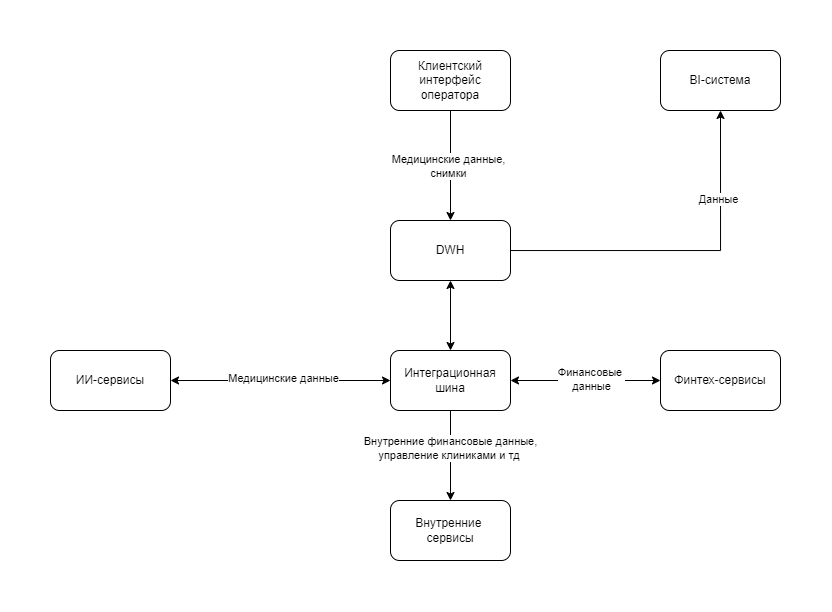

# ya-pr__arch-sprint-11
Проектная работа одиннадцатого спринта курса по архитектуре по

# О компании

Компания «Будущее 2.0» начиналась как медицинский стартап. Со временем он стал успешным. Теперь, чтобы ставить диагнозы и назначать лечение, врачи используют новейшее оборудование и ИИ. Не так давно компания купила банк, чтобы оказывать своим клиентам финансовые услуги. А сейчас она собирается интегрировать в свою систему несколько фармацевтических компаний и компанию, которая производит электронику для медицинского оборудования.

Исторически все данные в компании «Будущее 2.0» лежали в DWH. Его построили на базе SQL-сервера с большим количеством бизнес-логики и интерфейсом на Power Builder для прямой работы операторов в клиниках.

В DWH лежат:

- Данные по клиентам.
- Медицинские карты и истории болезни, в том числе — данные исследований, выполненных в ходе лечения.
- Финансовая история.
- Счета.
- Данные о кредитах.
- Данные по персоналу больницы.
- Данные по инвентаризации.
- Финансовая отчётность и много другой информации.

Бизнес хочет развивать все направления независимо, но в то же время иметь единую картину по бизнес-показателям. При этом уже сейчас нужную отчётность сложно построить за разумное время: очень много данных (сотни терабайт) и вариантов их использования. Это порождает большое количество трансформаций, что в свою очередь замедляет time-to-market и приводит к снижению производительности. В итоге сложные отчёты можно ждать часами.

Руководство поставило перед вами две задачи. Нужно:

1. **Сделать удобную «витрину данных».** Это портал самообслуживания, который легко масштабировать вне зависимости от количества бизнесов и их бизнес-целей. По задумке, сотрудник может получить здесь отчёт по любым срезам, которые выберет, если это позволяет его уровень доступа. Ещё нужно добавить возможность конструировать отчёты самостоятельно. Обратите внимание: в витрину данных не нужно добавлять медицинские карты, истории болезней и результаты медицинских исследований. Эти данные компания не будет использовать для аналитики.
2. **Предоставить архитектурное решение по изменению IТ-ландшафта в области работы с данными.** Оно должно предусматривать интеграцию новых бизнесов без дописывания огромного количества бизнес-логики в DWH.

Бизнес разрешил при необходимости отказаться от легаси-систем и мигрировать на новые сервисы, если вы предоставите весомое обоснование.

### Лендскейп компании

**В структуре компании выделяются четыре подразделения:**

- Головной офис.
- Клиники.
- ИИ-сервисы для работы с медицинскими данными в виде отдельной компании.
- Финтех-сервисы в виде отдельной компании с банковской лицензией.

**В рамках кейса нужно поработать с такими продуктами:**

- Финтех-сервисы.
- Внутренняя медицинская система-DWH с клиентским интерфейсом и дополнительной бизнес-логикой под финтех- и ИИ-сервисы.
- Много кастомизаций BI-системы поверх DWH.
- ИИ-сервисы для работы с медицинскими данными.
- Слой интеграций через старую шину данных.

**Сейчас развёрнуты такие технологии, сервисы и приложения:**

- DWH на базе Microsoft SQL-сервера 2008 года.
- Power BI.
- Power Builder.
- Шина на базе Apache Camel.
- ИИ-сервисы на Python.
- Финтех-сервисы на Golang и Java.

Так выглядят потоки данных в компании:

# Описание
В этот раз вы будете работать над кейсом компании «Будущее 2.0».

# Цели бизнеса

- **Промежуточное состояние (через пару месяцев).** Сформировано архитектурное решение по трансформации. Уточнены границы доменов и связи между ними. Запланированы конкретные проекты в доменах по развитию «витрины данных».
- **Финальное состояние (через год).** Реализован портал самообслуживания. Бизнес-пользователи в доменах могут использовать данные в рамках новой архитектуры. На этом этапе можно на некоторое время сохранить легаси-системы в отдельных доменах.

# **Как подготовиться к работе**

Подготовьте репозиторий, куда вы будете загружать решения заданий:

1. Проект этого спринта вы будете сдавать в Git-репозитории. Создайте публичный репозиторий в GitHub или GitLab. Назовите его «architecture-future_2_0».
2. Проект состоит из трёх заданий. Решение каждого задания нужно будет залить в отдельную директорию. Создайте в репозитории три директории и назовите их «Task1», «Task2», «Task3».
3. Чтобы ревьюеру было проще проверять вашу работу, а вам отслеживать изменения на разных итерациях, загрузите файлы в свой репозиторий и сделайте пул-реквест. На ревью нужно отправить ссылку на пул-реквест.

Если репозиторий готов, можно приступать к заданиям!

# **Задание 1**

1. **Спроектируйте архитектуру системы через год.** Составьте диаграмму контейнеров в модели C4.
2. **Опишите проблемные места.** Сделайте это в удобной для вас форме. Например, можете использовать список или таблицу. Постарайтесь формулировать описания так, чтобы они были понятны не только инженерам, но и бизнесу.
3. **Приоритизируйте выявленные проблемы.** Для этого вы можете использовать методы, которые изучили на курсе. Например, MoSCoW или матрицу Эйзенхауэра.

Когда задание будет готово, загрузите диаграмму, анализ проблемных мест и их приоритизацию в директорию Task1 в рамках пул-реквеста.

# **Задание 2**

1. **Разделите систему на домены,** чтобы их можно было независимо развивать без необходимости реализовать новую логику в DWH.
2. **Отразите потоки данных между доменами.** Для этого отрисуйте Data Flow Diagram. Отразите на ней запланированные изменения в архитектуре.
3. **Аргументируйте логику разделения на домены.** Опишите преимущества, которые получит компания, если разделит систему на домены так, как вы предлагаете.

Когда задание будет готово, загрузите DFD и свою аргументацию в директорию Task2 в рамках пул-реквеста.

# **Задание 3**

1. **Сформируйте технический радар.** Отразите на нём текущие технологии и методологии, а также предлагаемые изменения и технологии, которые сопутствуют основному стеку. Оформите радар в виде таблицы или круговой диаграммы.
2. **Составьте роадмап.** Отразите здесь изменения в технологическом ландшафте компании. Радар должен содержать этапы, их результаты, ответственные команды и ресурсы, которые потребуются. Оформите роадмап в draw.io или в другом инструменте на свой выбор.
3. **Обоснуйте изменения.** Опишите, зачем нужен каждый из этапов, которые вы включили в роадмап. Можете сделать это в том же файле, что и сам артефакт.

Когда задание будет готово, загрузите техрадар, роадмап и аргументацию в пользу этапов в директорию Task3 в рамках пул-реквеста.